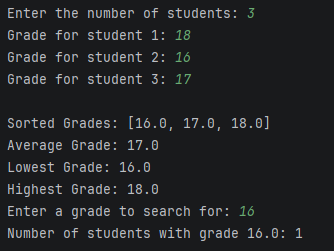
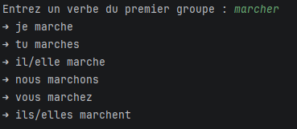
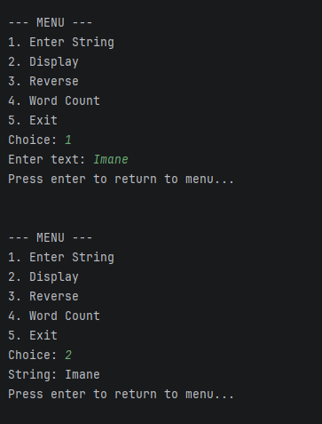
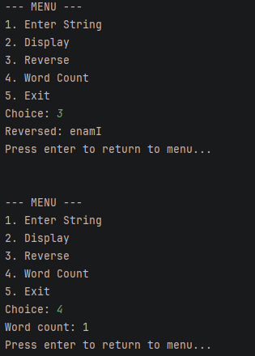
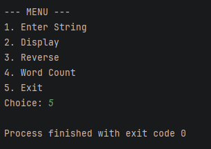
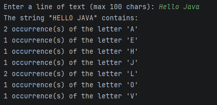

# Strings-and-Arrays-Java
OOP in Java – Strings and Arrays
Name: IMANE MEKKAOUI 
Class: 1-SDIA 

This repository contains Java solutions for the practical work on Strings and Arrays. It includes four exercises focusing on array manipulation, string processing, and menu-driven applications.

### Exercise 1: Student Grades Management
### Problem Description
The goal is to write a Java program that stores student grades in an array and performs the following operations:
Sort and display the list of grades.
Calculate and display the average grade.
Identify the highest and lowest grades.
Search for a specific grade and display how many students achieved it.

### The operations include:
1. Sorting grades in ascending order
2. Calculating the average grade
3. Identifying the minimum and maximum grades
4. Searching for a specific grade and counting how many students obtained it
### Key Concepts Used:
- Arrays for storing numerical data
- Scanner for reading user input
- Loops for data processing
- Use of Java utility methods for sorting

### Performance: 
- Primitive arrays provide direct memory access with zero object overhead 
- Making the solution both memory-efficient and fast.

### Approach:
- This method was chosen for its simplicity and reliability
- Offering a straightforward way to implement sorting and searching algorithms.

### Execution

### Exercise 2: First Group Verb Conjugation

### Problem
The program reads a French verb of the first group and displays its conjugation in the present tense.

### Solution and Technical Justifications

This program works with French verbs of the first group (verbs ending with “-er”).
The user enters a verb, and the program verifies whether it belongs to the first group. If valid, the verb is conjugated in the present tense.
The program removes the suffix “er” and adds the correct endings for each personal pronoun.
#### String Manipulation:
Check verb ending with -er using endsWith()

Extract root using substring()

Add appropriate suffixes for each pronoun

#### Validation and Error Handling:

Ensures only first-group verbs are conjugated

Provides informative message for invalid input

#### Approach:

Clear separation of input validation and conjugation logic

Efficient and readable for educational purposes

### Key Concepts Used
- String manipulation
- Conditional logic
- User input handling
### Execution

## Exercise 3: String Operations Menu
### Problem
The program provides a menu to perform operations on a string:
. Enter a string
. Display it
. Reverse it
. Count the number of words
### Solution

A menu is implemented using `switch`.  
`StringBuilder` is used to reverse the string.  
The number of words is calculated using `split()`.
#### Menu-based Structure:
. do-while loop with switch statement for repeated user operations

#### String Reversal:
. Uses StringBuilder.reverse() for efficiency and simplicity

#### Word Counting:
. Split string using split("\\s+") to handle multiple spaces

. trim() ensures no extra spaces affect the count

#### Approach:
. Modular design, easy to extend with new operations

. Efficient built-in Java methods minimize code complexity

### Operations Included
1. Entering a string
2. Displaying the string
3. Reversing the string
4. Counting the number of words
### Key Concepts Used
- Menu-based programming
- Loops and switch statements
- String manipulation techniques
### Execution

### Exercise 4: Letter Occurrence Counter
### Problem
The program counts the occurrences of each alphabet letter in a string, without distinguishing between uppercase and lowercase letters.

### Solution
A 26-element integer array is used.  
Each character is converted to uppercase and counted using its alphabetical index.

#### Array as Counter:

. 26-element integer array to track each letter’s frequency

. Index calculation: char - 'A'

#### Case Normalization:

Convert input to uppercase (toUpperCase()) for uniform counting

#### Iterative Traversal:

Loop through string and increment corresponding counter

#### Approach:

. Simple, memory-efficient, avoids using maps or additional data structures

. Handles both uppercase and lowercase letters transparently

### Operations Included
1. Case normalization
2. Letter frequency counting
3. Displaying results
### Key Concepts Used
- Character processing
- Arrays as counters
- Iterative traversal of strings
### Execution

### Conclusion

To conclude, this practical assignment was a valuable opportunity to apply core Java principles to real-world scenarios. By developing these four applications, I have enhanced my proficiency in array management, string-based algorithms, and creating interactive user interfaces.
