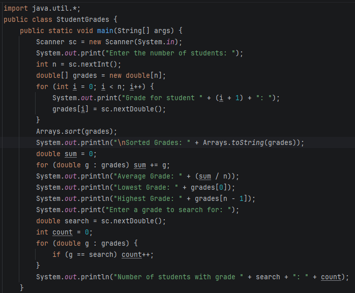
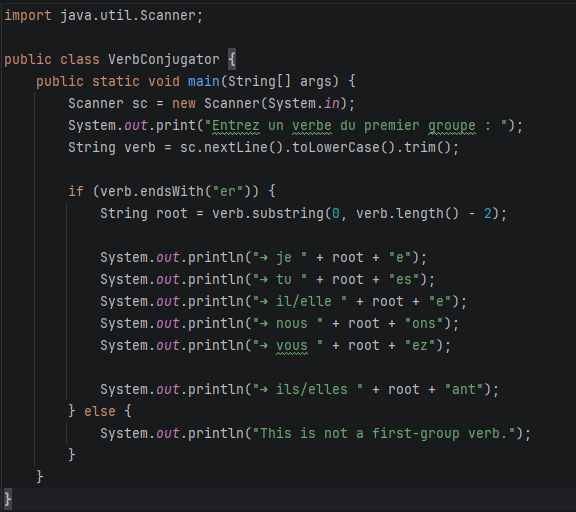
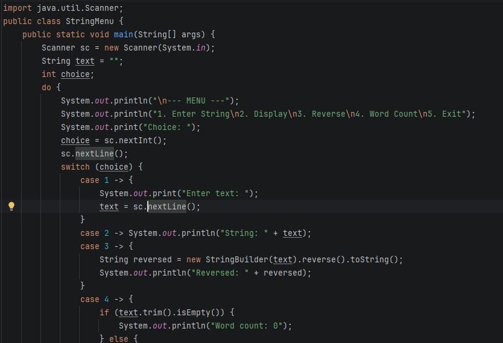
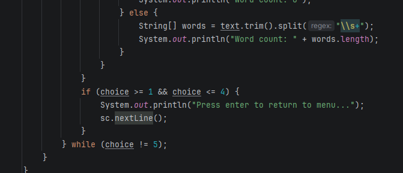
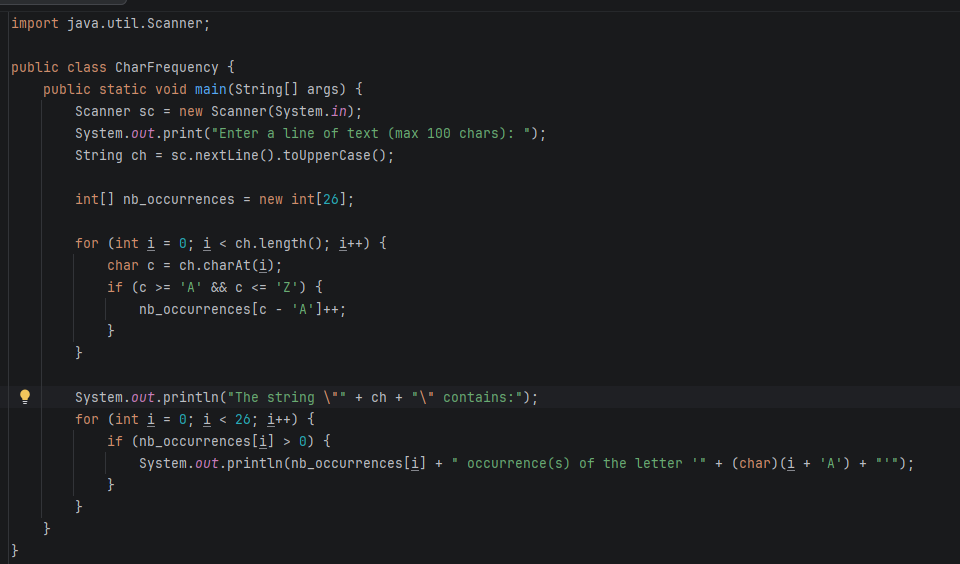

# Strings-and-Arrays-Java
OOP in Java – Strings and Arrays
Name: IMANE MEKKAOUI 
Class: 1-SDIA 

This repository contains Java solutions for the practical work on Strings and Arrays. It includes four exercises focusing on array manipulation, string processing, and menu-driven applications.

### Exercise 1: Student Grades Management
### Problem Description
The goal is to write a Java program that stores student grades in an array and performs the following operations:
Sort and display the list of grades.
Calculate and display the average grade.
Identify the highest and lowest grades.
Search for a specific grade and display how many students achieved it.
### The operations include:
1. Sorting grades in ascending order
2. Calculating the average grade
3. Identifying the minimum and maximum grades
4. Searching for a specific grade and counting how many students obtained it
### Key Concepts Used:
- Arrays for storing numerical data
- Scanner for reading user input
- Loops for data processing
- Use of Java utility methods for sorting

### Solution
```java
import java.util.*;
public class StudentGrade {
    public static void main(String[] args) {
        Scanner sc = new Scanner(System.in);
        System.out.print("Enter the number of students: ");
        int n = sc.nextInt();
        double[] grades = new double[n];
        for (int i = 0; i < n; i++) {
            System.out.print("Grade for student " + (i + 1) + ": ");
            grades[i] = sc.nextDouble();
        }
        Arrays.sort(grades);
        System.out.println("\nSorted Grades: " + Arrays.toString(grades));
        double sum = 0;
        for (double g : grades) sum += g;
        System.out.println("Average Grade: " + (sum / n));
        System.out.println("Lowest Grade: " + grades[0]);
        System.out.println("Highest Grade: " + grades[n - 1]);
        System.out.print("Enter a grade to search for: ");
        double search = sc.nextDouble();
        int count = 0;
        for (double g : grades) {
            if (g == search) count++;
        }
        System.out.println("Number of students with grade " + search + ": " + count);
    }
}
```
### Execution



### Exercise 2: First Group Verb Conjugation

### Problem
The program reads a French verb of the first group and displays its conjugation in the present tense.

### Solution
The program checks if the verb ends with `"er"`.  
The ending `"er"` is removed and correct present tense endings are added.
```java
import java.util.Scanner;

public class VerbConjugator {
    public static void main(String[] args) {
        Scanner sc = new Scanner(System.in);
        System.out.print("Entrez un verbe du premier groupe : ");
        String verb = sc.nextLine().toLowerCase().trim();

        if (verb.endsWith("er")) {
            String root = verb.substring(0, verb.length() - 2);

            System.out.println("➔ je " + root + "e");
            System.out.println("➔ tu " + root + "es");
            System.out.println("➔ il/elle " + root + "e");
            System.out.println("➔ nous " + root + "ons");
            System.out.println("➔ vous " + root + "ez");

            System.out.println("➔ ils/elles " + root + "ent");
        } else {
            System.out.println("This is not a first-group verb.");
        }
    }
}
```
### Execution



## Exercise 3: String Operations Menu
### Problem
The program provides a menu to perform operations on a string:
- Enter a string
- Display it
- Reverse it
- Count the number of words

### Solution
A menu is implemented using `switch`.  
`StringBuilder` is used to reverse the string.  
The number of words is calculated using `split()`.
```java
import java.util.Scanner;
public class StringMenu {
    public static void main(String[] args) {
        Scanner sc = new Scanner(System.in);
        String text = "";
        int choice;
        do {
            System.out.println("\n--- MENU ---");
            System.out.println("1. Enter String\n2. Display\n3. Reverse\n4. Word Count\n5. Exit");
            System.out.print("Choice: ");
            choice = sc.nextInt();
            sc.nextLine();
            switch (choice) {
                case 1 -> {
                    System.out.print("Enter text: ");
                    text = sc.nextLine();
                }
                case 2 -> System.out.println("String: " + text);
                case 3 -> {
                    String reversed = new StringBuilder(text).reverse().toString();
                    System.out.println("Reversed: " + reversed);
                }
                case 4 -> {
                    if (text.trim().isEmpty()) {
                        System.out.println("Word count: 0");
                    } else {
                        String[] words = text.trim().split("\\s+");
                        System.out.println("Word count: " + words.length);
                    }
                }
            }
            if (choice >= 1 && choice <= 4) {
                System.out.println("Press enter to return to menu...");
                sc.nextLine();
            }
        } while (choice != 5);
    }
}
```
### Execution



### Exercise 4:
### Problem
The program counts the occurrences of each alphabet letter in a string, without distinguishing between uppercase and lowercase letters.

### Solution
A 26-element integer array is used.  
Each character is converted to uppercase and counted using its alphabetical index.
```java
import java.util.Scanner;

public class CharFrequency {
    public static void main(String[] args) {
        Scanner sc = new Scanner(System.in);
        System.out.print("Enter a line of text (max 100 chars): ");
        String ch = sc.nextLine().toUpperCase();

        int[] nb_occurrences = new int[26];

        for (int i = 0; i < ch.length(); i++) {
            char c = ch.charAt(i);
            if (c >= 'A' && c <= 'Z') {
                nb_occurrences[c - 'A']++;
            }
        }

        System.out.println("The string \"" + ch + "\" contains:");
        for (int i = 0; i < 26; i++) {
            if (nb_occurrences[i] > 0) {
                System.out.println(nb_occurrences[i] + " occurrence(s) of the letter '" + (char)(i + 'A') + "'");
            }
        }
    }
}
```
### Execution


